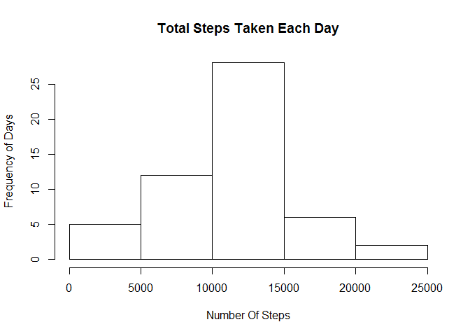
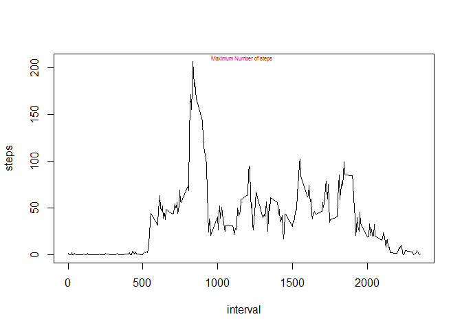

# Reproducible Research: Peer Assessment 1


## Loading and preprocessing the data

Dplyr Library has to be loaded in order for this code to work. We are going to load the data and but it in a data frame for later processing. Before loading the data, we are going to load the dplyr library.


```r
library(dplyr)
```

```
## 
## Attaching package: 'dplyr'
## 
## The following object is masked from 'package:stats':
## 
##     filter
## 
## The following objects are masked from 'package:base':
## 
##     intersect, setdiff, setequal, union
```

```r
data <- read.csv("activity.csv")
data <- tbl_df(data)
```

## What is mean total number of steps taken per day?

For this part of the assignment, you can ignore the missing values in the dataset.

1.Calculate the total number of steps taken per day


```r
totalPerDay <- data[complete.cases(data), ]
totalPerDay <- totalPerDay %>%
               group_by(date) %>%
               summarise(steps = sum(steps))
```

2.Make a histogram of the total number of steps taken each day


```r
hist(totalPerDay$steps, main = "Total Steps Taken Each Day", xlab = "Number Of Steps", ylab = "Frequency of Days")
```

 

3 .Calculate and report the mean and median of the total number of steps taken per day

  + Mean

```r
mean(totalPerDay$steps)
```

```
## [1] 10766.19
```

  + Median

```r
mean(totalPerDay$steps)
```

```
## [1] 10766.19
```


## What is the average daily activity pattern?

1. Make a time series plot (i.e. type = "l") of the 5-minute interval (x-axis) and the average number of steps taken, averaged across all days (y-axis)

```r
avg <- data[complete.cases(data), ]
avg =  avg %>%
     group_by(interval) %>%
     summarise(steps = mean(steps))

plot (avg, type="l")
```

 

2. Which 5-minute interval, on average across all the days in the dataset, contains the maximum number of steps?


```r
library(calibrate)
```

```
## Warning: package 'calibrate' was built under R version 3.1.3
```

```
## Loading required package: MASS
## 
## Attaching package: 'MASS'
## 
## The following object is masked from 'package:dplyr':
## 
##     select
```

```r
maxInterval <- subset(avg, avg$steps == max(avg$steps))
plot (avg, type="l")
textxy(X = maxInterval$interval, Y = maxInterval$steps, labs="Maximum Number of steps", col="red")
```

 


## Imputing missing values

Note that there are a number of days/intervals where there are missing values (coded as NA). The presence of missing days may introduce bias into some calculations or summaries of the data.

1. Calculate and report the total number of missing values in the dataset (i.e. the total number of rows with NAs)

Total Number of missing values is: 

```r
nrow(data) - nrow(data[complete.cases(data), ])
```

```
## [1] 2304
```

## Are there differences in activity patterns between weekdays and weekends?
